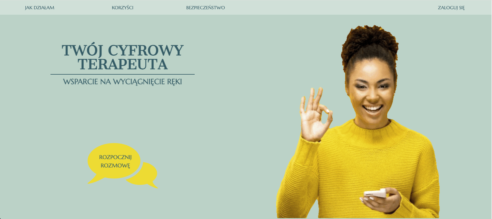
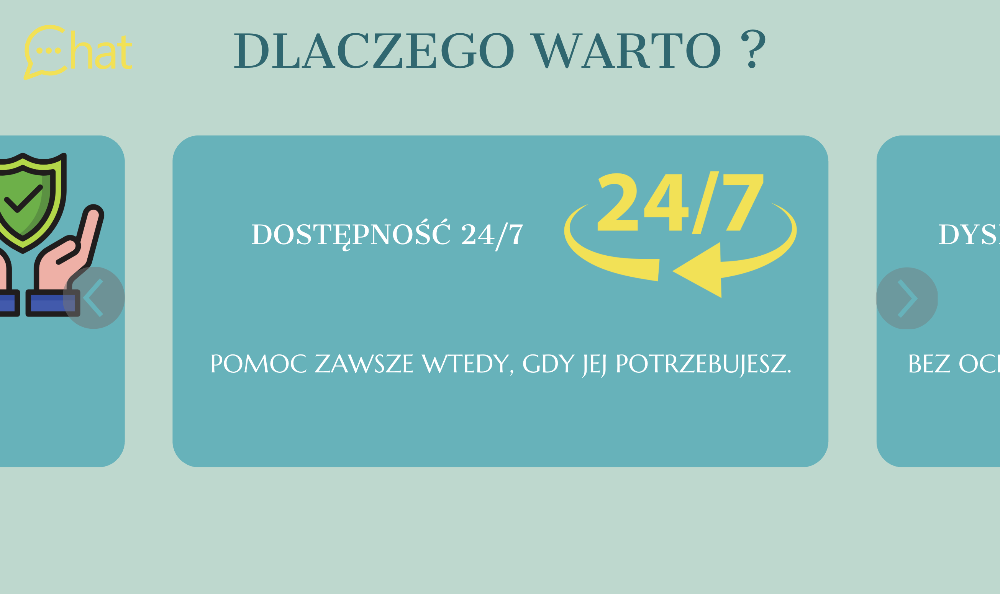

# autonomic-chatbot-fe





## English Description 🇬🇧
An application supporting individuals experiencing mood deterioration. It enables conversation with a virtual therapist who provides support and analyzes current mood. The application offers helpful tips and methods for coping with crises. If necessary, it recommends and encourages contact with a qualified specialist. It generates a summary of the session and conclusions worth sharing during a visit to a specialist.
The application can be accessed directly from the website or by logging in through a Telegram account.

## Features
- Home page presenting the basic capabilities of the application
- Chatbot supporting users in dealing with difficult emotions
- Detailed description of conversation stages
- Description of benefits from using the application
- Presentation of security measures, data storage methods, and statistics access
- Demo of sample conversation and option to start your own chat
- Telegram API integration
- Responsive interface optimized for all devices
- Generation of therapeutic session summaries

## Project Structure
- `App`: Main component with routing configuration
- `Header`: Header with main navigation
- `Home`: Home page showing how the application works
- `SupportYou`: Presentation of support options
- `BenefitsShowcase`: Benefits of using the application
- `DataSecurityPanel`: Explanation of security and data protection
- `ChatPreviewDemo`: Element encouraging chat initiation
- `LoginPage`: User Login and Registration
- `ChatInterface`: Main interface for conversation with the bot
- `SummaryGenerator`: Component generating session summary

## Technologies Used
- TypeScript - static typing
- React - frontend framework
- Vite - build tool
- React Router - application routing
- SASS - component styling
- Vitest - application testing
- Telegram Bot API - messenger integration

## Installation and Setup 
1. Clone the repository
    ```bash
    git clone https://github.com/Y0ucandev/autonomic-chatbot-fe.git
2. Install dependencies
    ```bash
    npm install 
3. Run the application in development mode
    ```bash
    npm run dev

## Requirements
- Node.js 16+
- npm 7+2. Install dependencies
    ```bash
    npm install 
3. Run the application in development mode
    ```bash
    npm run dev
    
## Requirements 
- Node.js 16+
- npm 7+

## Polski Opis 🇵🇱
Aplikacja wspierająca osoby w sytuacji pogorszenia nastroju. Umożliwia rozmowę z wirtualnym terapeutą, udzielającym wsparcia i analizującym bieżący nastrój. Aplikacja dostarcza pomocne wskazówki oraz metody radzenia sobie w kryzysie. Jeśli to konieczne, rekomenduje i zachęca do kontaktu z wykwalifikowanym specjalistą. Generuje podsumowanie spotkania oraz wnioski, które warto przekazać podczas wizyty u specjalisty.
Z aplikacji można korzystać bezpośrednio z poziomu strony lub zalogować się przez swoje konto "Telegram".

## Funkcjonalności
- Strona główna przedstawiająca podstawowe możliwości aplikacji
- Chatbot wspierający użytkownika w radzeniu sobie z trudnymi emocjami
- Szczegółowy opis poszczególnych etapów prowadzenia rozmowy
- Opis korzyści wynikających z korzystania z aplikacji
- Przedstawienie zabezpieczeń, sposobu przechowywania danych i dostępu do statystyk
- Prezentacja przykładowej rozmowy i możliwość rozpoczęcia własnego czatu
- Integracja z API Telegramu
- Responsywny interfejs dostosowany do wszystkich urządzeń
- Generowanie podsumowań sesji terapeutycznych

## Struktura projektu
- `App`: Komponent główny z konfiguracją routingu
- `Header`: Nagłówek z nawigacją główną
- `Home`: Strona główna przedstawiająca działanie aplikacji
- `SupportYou`: Przedstawienie możliwości udzielanego wsparcia
- `BenefitsShowcase`: Korzyści korzystania z aplikacji
- `DataSecurityPanel`: Wyjaśnienie zabezpieczeń i ochrony danych
- `ChatPreviewDemo`: Element zachęcający do rozpoczęcia chatu
- `LoginPage`: Logowanie i rejestracja użytkownika
- `ChatInterface`: Główny interfejs prowadzenia rozmowy z botem
- `SummaryGenerator`: Komponent generujący podsumowanie sesji

## Zastosowane technologie
- TypeScript - typowanie statyczne
- React - framework frontendowy
- Vite - narzędzie budowania
- React Router - routing aplikacji
- SASS - stylowanie komponentów
- Vitest - testy aplikacji
- Telegram Bot API - integracja z komunikatorem

## Instalacja i uruchomienie
1. Sklonuj repozytorium
   ```bash
   git clone https://github.com/Y0ucandev/autonomic-chatbot-fe.git
2. Zainstaluj zależności
    ```bash
    npm install 
3. Uruchom aplikacje w trybie deweloperskim
    ```bash 
    npm run dev
    
## Wymagane
- Node.js 16+
- npm 7+
2. zainstaluj zależności
    ```bash
    npm install 
3. Uruchom aplikacje w trybie deweloperskim
    ```bash
    npm run dev

## Wymagane 
- Node.js 16+
- npm 7+